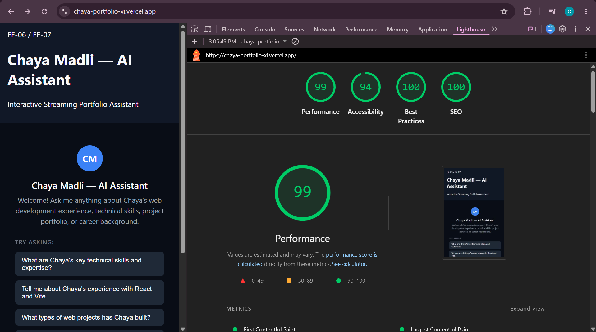
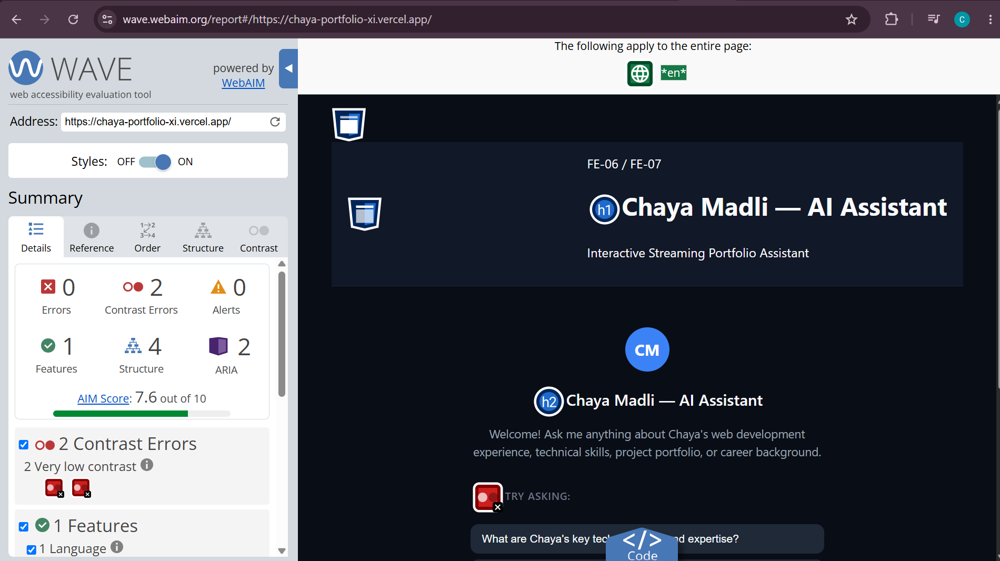

# Accessibility & Performance Audit

## Project

**Portfolio:** Chaya Madli — AI Assistant  
**Live site:** https://chaya-portfolio-xi.vercel.app/

## Audit Goal

The goal of this audit was to check the deployed portfolio for mobile performance, accessibility, WAVE accessibility issues, and keyboard usability.

---

## Lighthouse Results — After Audit

The deployed portfolio was tested using Chrome Lighthouse with the **Mobile** device preset.

| Category | Score |
|---|---:|
| Performance | 99 |
| Accessibility | 94 |
| Best Practices | 100 |
| SEO | 100 |

### Lighthouse evidence



The final Lighthouse audit achieved **99 Performance** and **94 Accessibility**, which is above the assignment's target of 90+ and above the absolute minimum of 80.

---

## WAVE Accessibility Results

The deployed portfolio was also checked using the WAVE accessibility evaluation tool.

Final WAVE results:

- Errors: **0**
- Contrast Errors: **0**
- Alerts: **0**
- Features: **1**
- Structure: **4**
- ARIA: **2**
- AIM Score: **10/10**



The WAVE audit reported **zero errors, zero contrast errors, and zero alerts**.

---

## Keyboard-Only Test

I performed a keyboard-only pass through the primary portfolio flow.

I used:

- `Tab` to move between interactive elements
- `Shift + Tab` to move backwards
- `Enter` to activate controls

The main navigation and interactive elements were reachable using the keyboard.

The AI chat flow was also tested without relying on the mouse:

1. The chat input could be reached using `Tab`.
2. A question could be entered using the keyboard.
3. The message could be submitted.
4. During the streaming response, the Stop control could be reached using the keyboard.

This confirms that the primary interaction can be completed using keyboard navigation.

---

## Changes / Improvements

The audit focused on:

- keyboard navigation
- visible keyboard focus
- accessible interactive controls
- chat interaction accessibility
- streamed AI interaction
- responsive/mobile behavior
- performance and bundle size
- semantic structure and ARIA usage
- color contrast

The final WAVE audit confirmed that there were no remaining WAVE errors or contrast errors.

---

## Before vs After

A separate baseline screenshot was not captured before the accessibility/performance improvements. Therefore, I am not inventing baseline scores.

The measurable final results are:

- Lighthouse Performance: **99**
- Lighthouse Accessibility: **94**
- Lighthouse Best Practices: **100**
- Lighthouse SEO: **100**
- WAVE Errors: **0**
- WAVE Contrast Errors: **0**
- WAVE Alerts: **0**
- WAVE AIM Score: **10/10**

These results were measured against the deployed portfolio.

---

## Performance Notes

The portfolio uses a React/Vite application with an AI chat interface.

The production build was successfully generated with:

```bash
npm run build